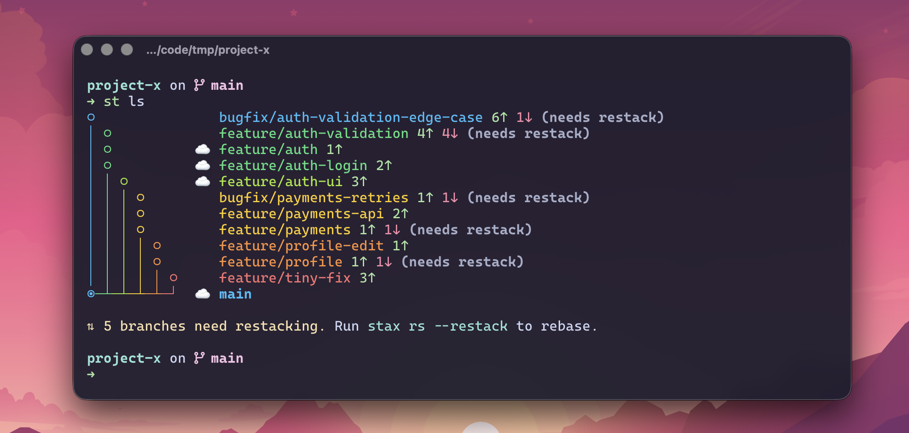

<div align="center">
  <h1>stax</h1>
  <p>
    <strong>A modern CLI for stacked Git branches and PRs.</strong>
  </p>

  <p>
    <a href="https://github.com/cesarferreira/stax/actions/workflows/rust-tests.yml"></a>
    <a href="https://crates.io/crates/stax"></a>
    
    
    
  </p>

  
</div>

## What are Stacked Branches?

Instead of one massive PR with 50 files, stacked branches let you split work into small, reviewable pieces that build on each other (and visualize it as a tree).

**Why this is great:**
- **Smaller reviews** - Each PR is focused, so reviewers move faster and catch more issues
- **Parallel progress** - Keep building on top while lower PRs are still in review
- **Safer shipping** - Merge foundations first; reduce the risk of “one giant PR” landing at once
- **Cleaner history** - Each logical change lands independently (easier to understand, revert, and `git blame`)

<details>
<summary>Example stack</summary>

```text
◉  feature/auth-ui 1↑
○  feature/auth-api 1↑
○  main
```
</details>

Each branch is a focused PR. Reviewers see small diffs. You ship faster.

## Why stax?

stax is a modern stacked-branch workflow that keeps PRs small, rebases safe, and the whole stack easy to reason about.

- **Blazing fast** - Native Rust binary (~22ms `stax ls` on a 10-branch stack)
- **Terminal UX** - Interactive TUI with tree view, PR status, diff viewer, and reorder mode
- **Ship stacks, not mega-PRs** - Submit/update a whole stack of PRs with correct bases in one command
- **Safe history rewriting** - Transactional restacks + automatic backups + `stax undo` / `stax redo`
- **Merge the stack for you** - Cascade merge bottom → current, with rebase/PR-base updates along the way
- **Drop-in compatible** - Uses freephite metadata format—existing stacks migrate instantly

## Install

```bash
# Homebrew (macOS/Linux)
brew tap cesarferreira/tap && brew install stax

# Or with cargo binstall
cargo binstall stax
```

## Quick Start

```bash
# 1. Authenticate with GitHub
stax auth

# 2. Create stacked branches
stax create auth-api           # First branch off main
stax create auth-ui            # Second branch, stacked on first

# 3. View your stack
stax ls
# ◉  auth-ui 1↑                ← you are here
# ○  auth-api 1↑
# ○  main

# 4. Submit PRs for the whole stack
stax ss
# Creating PR for auth-api... ✓ #12 (targets main)
# Creating PR for auth-ui... ✓ #13 (targets auth-api)

# 5. After reviews, sync and rebase
stax rs --restack
```

## Interactive Branch Creation

Run `stax create` without arguments to launch the guided wizard:

```bash
$ stax create

╭─ Create Stacked Branch ─────────────────────────────╮
│ Parent: feature/auth (current branch)               │
╰─────────────────────────────────────────────────────╯

? Branch name: auth-validation

? What to include:
  ● Stage all changes (3 files modified)
  ○ Empty branch (no changes)

? Commit message (Enter to skip): Validate auth tokens

✓ Created cesar/auth-validation
  → Stacked on feature/auth
```

## Interactive TUI

Run `stax` with no arguments to launch the interactive terminal UI:

```bash
stax
```

<p align="center">
  
</p>

**TUI Features:**
- Visual stack tree with PR status, sync indicators, and commit counts
- Full diff viewer for each branch
- Keyboard-driven: checkout, restack, submit PRs, create/rename/delete branches
- **Reorder mode**: Rearrange branches in your stack with `o` then `Shift+↑/↓`

| Key | Action |
|-----|--------|
| `↑/↓` | Navigate branches |
| `Enter` | Checkout branch |
| `r` | Restack selected branch |
| `s` | Submit stack |
| `o` | Enter reorder mode (reparent branches) |
| `n` | Create new branch |
| `d` | Delete branch |
| `?` | Show all keybindings |

### Reorder Mode

Rearrange branches within your stack without manually running reparent commands:

<p align="center">
  
</p>

1. Select a branch and press `o` to enter reorder mode
2. Use `Shift+↑/↓` to move the branch up or down in the stack
3. Preview shows which reparent operations will happen
4. Press `Enter` to apply changes and automatically restack

### Split Mode

Split a branch with many commits into multiple stacked branches:

```bash
stax split
```

<p align="center">
  
</p>

**How it works:**
1. Run `stax split` on a branch with multiple commits
2. Navigate commits with `j/k` or arrows
3. Press `s` to mark a split point and enter a branch name
4. Preview shows the resulting branch structure in real-time
5. Press `Enter` to execute - new branches are created with proper metadata

| Key | Action |
|-----|--------|
| `j/k` or `↑/↓` | Navigate commits |
| `s` | Mark split point at cursor (enter branch name) |
| `d` | Remove split point at cursor |
| `Enter` | Execute split |
| `?` | Show help |
| `q/Esc` | Cancel and quit |

**Example:** You have a branch with commits A→B→C→D→E. Mark splits after B ("part1") and D ("part2"):

```
Before:                    After:
main                       main
  └─ my-feature (A-E)        └─ part1 (A, B)
                                 └─ part2 (C, D)
                                      └─ my-feature (E)
```

Split uses the transaction system, so you can `stax undo` if needed.

## Core Commands

| Command | What it does |
|---------|--------------|
| `stax` | Launch interactive TUI |
| `stax ls` | Show your stack with PR status and what needs rebasing |
| `stax create <name>` | Create a new branch stacked on current |
| `stax ss` | Submit stack - push all branches and create/update PRs |
| `stax merge` | Merge PRs from bottom of stack up to current branch |
| `stax rs` | Repo sync - pull trunk, clean up merged branches |
| `stax rs --restack` | Sync and rebase all branches onto updated trunk |
| `stax co` | Interactive branch checkout with fuzzy search |
| `stax u` / `stax d` | Move up/down the stack |
| `stax m` | Modify - stage all changes and amend current commit |
| `stax pr` | Open current branch's PR in browser |
| `stax undo` | Undo last operation (restack, submit, etc.) |

## Safe History Rewriting with Undo

Stax makes rebasing and force-pushing **safe** with automatic backups and one-command recovery:

```bash
# Make a mistake while restacking? No problem.
stax restack
# ✗ conflict in feature/auth
# Your repo is recoverable via: stax undo

# Instantly restore to before the restack
stax undo
# ✓ Undone! Restored 3 branch(es).
```

### How It Works

Every potentially-destructive operation (`restack`, `submit`, `sync --restack`, TUI reorder) is **transactional**:

1. **Snapshot** - Before touching anything, stax records the current commit SHA of each affected branch
2. **Backup refs** - Creates Git refs at `refs/stax/backups/<op-id>/<branch>` pointing to original commits
3. **Execute** - Performs the operation (rebase, force-push, etc.)
4. **Receipt** - Saves an operation receipt to `.git/stax/ops/<op-id>.json`

If anything goes wrong, `stax undo` reads the receipt and restores all branches to their exact prior state.

### Undo & Redo Commands

| Command | Description |
|---------|-------------|
| `stax undo` | Undo the last operation |
| `stax undo <op-id>` | Undo a specific operation |
| `stax redo` | Redo (re-apply) the last undone operation |

**Flags:**
- `--yes` - Auto-approve prompts (useful for scripts)
- `--no-push` - Only restore local branches, don't touch remote

### Remote Recovery

If the undone operation had force-pushed branches, stax will prompt:

```bash
stax undo
# ✓ Restored 2 local branch(es)
# This operation force-pushed 2 branch(es) to remote.
# Force-push to restore remote branches too? [y/N]
```

Use `--yes` to auto-approve or `--no-push` to skip remote restoration.

## Real-World Example

You're building a payments feature. Instead of one 2000-line PR:

```bash
# Start the foundation
stax create payments-models
# ... write database models, commit ...

# Stack the API layer on top
stax create payments-api
# ... write API endpoints, commit ...

# Stack the UI on top of that
stax create payments-ui
# ... write React components, commit ...

# View your stack
stax ls
# ◉  payments-ui 1↑           ← you are here
# ○  payments-api 1↑
# ○  payments-models 1↑
# ○  main

# Submit all 3 as separate PRs (each targeting its parent)
stax ss
# Creating PR for payments-models... ✓ #101 (targets main)
# Creating PR for payments-api... ✓ #102 (targets payments-models)
# Creating PR for payments-ui... ✓ #103 (targets payments-api)
```

Reviewers can now review 3 small PRs instead of one giant one. When `payments-models` is approved and merged:

```bash
stax rs --restack
# ✓ Pulled latest main
# ✓ Cleaned up payments-models (merged)
# ✓ Rebased payments-api onto main
# ✓ Rebased payments-ui onto payments-api
# ✓ Updated PR #102 to target main
```

## Cascade Stack Merge

Merge your entire stack with one command! `stax merge` intelligently merges PRs from the bottom of your stack up to your current branch, handling rebases and PR updates automatically.

### How It Works

```
Stack:  main ← PR-A ← PR-B ← PR-C ← PR-D

Position        │ What gets merged
────────────────┼─────────────────────────────
On PR-A         │ Just PR-A (1 PR)
On PR-B         │ PR-A, then PR-B (2 PRs)
On PR-C         │ PR-A → PR-B → PR-C (3 PRs)
On PR-D (top)   │ Entire stack (4 PRs)
```

The merge scope depends on your current branch:
- **Bottom of stack**: Merges just that one PR
- **Middle of stack**: Merges all PRs from bottom up to current
- **Top of stack**: Merges the entire stack

### Example Usage

```bash
# View your stack
stax ls
# ◉  payments-ui 1↑           ← you are here
# ○  payments-api 1↑
# ○  payments-models 1↑
# ○  main

# Merge all 3 PRs into main
stax merge
```

You'll see an interactive preview before merging:

```
╭──────────────────────────────────────────────────────╮
│                    Stack Merge                       │
╰──────────────────────────────────────────────────────╯

You are on: payments-ui (PR #103)

This will merge 3 PRs from bottom → current:

  ┌─────────────────────────────────────────────────┐
  │  1. payments-models (#101)       ✓ Ready        │
  │     ├─ CI: ✓ passed                             │
  │     ├─ Reviews: ✓ 2/2 approved                  │
  │     └─ Merges into: main                        │
  ├─────────────────────────────────────────────────┤
  │  2. payments-api (#102)          ✓ Ready        │
  │     ├─ CI: ✓ passed                             │
  │     ├─ Reviews: ✓ 1/1 approved                  │
  │     └─ Merges into: main (after rebase)         │
  ├─────────────────────────────────────────────────┤
  │  3. payments-ui (#103)           ✓ Ready        │  ← you are here
  │     ├─ CI: ✓ passed                             │
  │     ├─ Reviews: ✓ 1/1 approved                  │
  │     └─ Merges into: main (after rebase)         │
  └─────────────────────────────────────────────────┘

Merge method: squash (change with --method)

? Proceed with merge? [y/N]
```

### What Happens During Merge

For each PR in the stack (bottom to top):

1. **Wait for CI** - Polls until CI passes (or use `--no-wait` to skip)
2. **Merge** - Merges the PR using your chosen method (squash/merge/rebase)
3. **Rebase next** - Rebases the next PR onto updated main
4. **Update PR base** - Changes the next PR's target from the merged branch to main
5. **Push** - Force-pushes the rebased branch
6. **Repeat** - Continues until all PRs are merged

If anything fails (CI, conflicts, permissions), the merge stops safely. Already-merged PRs remain merged, and you can fix the issue and run `stax merge` again to continue.

### Merge Options

```bash
# Merge with preview only (no actual merge)
stax merge --dry-run

# Merge entire stack regardless of current position
stax merge --all

# Choose merge strategy
stax merge --method squash    # (default) Squash and merge
stax merge --method merge     # Create merge commit
stax merge --method rebase    # Rebase and merge

# Skip CI polling (fail if not ready)
stax merge --no-wait

# Keep branches after merge (don't delete)
stax merge --no-delete

# Set custom CI timeout (default: 30 minutes)
stax merge --timeout 60

# Skip confirmation prompt
stax merge --yes
```

### Partial Stack Merge

You can merge just part of your stack by checking out a middle branch:

```bash
# Stack: main ← auth ← auth-api ← auth-ui ← auth-tests
stax checkout auth-api

# This merges only: auth, auth-api (not auth-ui or auth-tests)
stax merge

# Remaining branches (auth-ui, auth-tests) are rebased onto main
# Run stax merge again later to merge those too
```

## Working with Multiple Stacks

You can have multiple independent stacks at once:

```bash
# You're working on auth...
stax create auth
stax create auth-login
stax create auth-validation

# Teammate needs urgent bugfix reviewed - start a new stack
stax co main                   # or: stax t
stax create hotfix-payment

# View everything
stax ls
# ○  auth-validation 1↑
# ○  auth-login 1↑
# ○  auth 1↑
# │ ◉  hotfix-payment 1↑      ← you are here
# ○─┘  main
```

## Navigation

| Command | What it does |
|---------|--------------|
| `stax u` | Move up to child branch |
| `stax d` | Move down to parent branch |
| `stax u 3` | Move up 3 branches |
| `stax top` | Jump to tip of current stack |
| `stax bottom` | Jump to base of stack (first branch above trunk) |
| `stax t` | Jump to trunk (main/master) |
| `stax prev` | Toggle to previous branch (like `git checkout -`) |
| `stax co` | Interactive picker with fuzzy search |

## Reading the Stack View

```
○        feature/validation 1↑
◉        feature/auth 2↑ 1↓ ⟳
│ ○    ☁ feature/payments PR #42
○─┘    ☁ main
```

| Symbol | Meaning |
|--------|---------|
| `◉` | Current branch |
| `○` | Other branch |
| `☁` | Has remote tracking |
| `1↑` | 1 commit ahead of parent |
| `1↓` | 1 commit behind parent |
| `⟳` | Needs restacking (parent changed) |
| `PR #42` | Has open PR |

## Configuration

```bash
stax config  # Show config path and current settings
```

Config at `~/.config/stax/config.toml`:

```toml
[branch]
prefix = "cesar/"      # Auto-prefix branches: "auth" → "cesar/auth"

[remote]
name = "origin"
provider = "github"    # github, gitlab, gitea

[ui]
tips = true            # Show contextual suggestions (default: true)
```

### GitHub Authentication

stax looks for a GitHub token in the following order (first found wins):

1. `STAX_GITHUB_TOKEN` environment variable
2. `GITHUB_TOKEN` environment variable
3. Credentials file (`~/.config/stax/.credentials`)

```bash
# Option 1: stax-specific env var (highest priority)
export STAX_GITHUB_TOKEN="ghp_xxxx"

# Option 2: Standard GitHub env var (works with other tools too)
export GITHUB_TOKEN="ghp_xxxx"

# Option 3: Interactive setup (saves to credentials file)
stax auth
```

The credentials file is created with `600` permissions (read/write for owner only).

## Freephite/Graphite Compatibility

stax uses the same metadata format as freephite and supports similar commands:

| freephite | stax | graphite | stax |
|-----------|------|----------|------|
| `fp ss` | `stax ss` | `gt submit` | `stax submit` |
| `fp rs` | `stax rs` | `gt sync` | `stax sync` |
| `fp bc` | `stax bc` | `gt create` | `stax create` |
| `fp bco` | `stax bco` | `gt checkout` | `stax co` |
| `fp bu` | `stax bu` | `gt up` | `stax u` |
| `fp bd` | `stax bd` | `gt down` | `stax d` |
| `fp ls` | `stax ls` | `gt log` | `stax log` |

**Migration is instant** - just install stax and your existing stacks work.

## All Commands

<details>
<summary>Click to expand full command reference</summary>

### Stack Operations
| Command | Alias | Description |
|---------|-------|-------------|
| `stax status` | `s`, `ls` | Show stack (simple view) |
| `stax log` | `l` | Show stack with commits and PR info |
| `stax submit` | `ss` | Push and create/update PRs |
| `stax merge` | | Merge PRs from bottom of stack to current |
| `stax sync` | `rs` | Pull trunk, delete merged branches |
| `stax restack` | | Rebase current branch onto parent |
| `stax diff` | | Show diffs for each branch vs parent |
| `stax range-diff` | | Show range-diff for branches needing restack |

### Branch Management
| Command | Alias | Description |
|---------|-------|-------------|
| `stax create <name>` | `c`, `bc` | Create stacked branch |
| `stax checkout` | `co`, `bco` | Interactive branch picker |
| `stax modify` | `m` | Stage all + amend current commit |
| `stax rename` | `b r` | Rename branch and optionally edit commit message |
| `stax branch track` | | Track an existing branch |
| `stax branch reparent` | | Change parent of a branch |
| `stax branch delete` | | Delete a branch |
| `stax branch fold` | | Fold branch into parent |
| `stax branch squash` | | Squash commits on branch |

### Navigation
| Command | Alias | Description |
|---------|-------|-------------|
| `stax up [n]` | `u`, `bu` | Move up n branches |
| `stax down [n]` | `d`, `bd` | Move down n branches |
| `stax top` | | Move to stack tip |
| `stax bottom` | | Move to stack base |
| `stax trunk` | `t` | Switch to trunk |
| `stax prev` | `p` | Toggle to previous branch |

### Interactive
| Command | Description |
|---------|-------------|
| `stax` | Launch interactive TUI |
| `stax split` | Interactive TUI to split branch into multiple stacked branches |

### Recovery
| Command | Description |
|---------|-------------|
| `stax undo` | Undo last operation (restack, submit, etc.) |
| `stax undo <op-id>` | Undo a specific operation by ID |
| `stax redo` | Re-apply the last undone operation |

### Utilities
| Command | Description |
|---------|-------------|
| `stax auth` | Set GitHub token |
| `stax config` | Show configuration |
| `stax doctor` | Check repo health |
| `stax continue` | Continue after resolving conflicts |
| `stax pr` | Open PR in browser |
| `stax comments` | Show PR comments with rendered markdown |
| `stax comments --plain` | Show PR comments as raw markdown |

### Common Flags
- `stax create -m "msg"` - Create branch with commit message
- `stax create -a` - Stage all changes
- `stax create -am "msg"` - Stage all and commit
- `stax rename new-name` - Rename current branch
- `stax rename -e` - Rename and edit commit message
- `stax submit --draft` - Create PRs as drafts
- `stax submit --yes` - Auto-approve prompts
- `stax submit --no-prompt` - Use defaults, skip interactive prompts
- `stax submit --reviewers alice,bob` - Add reviewers
- `stax submit --labels bug,urgent` - Add labels
- `stax submit --assignees alice` - Assign users
- `stax merge --all` - Merge entire stack
- `stax merge --method squash` - Choose merge method (squash/merge/rebase)
- `stax merge --dry-run` - Preview merge without executing
- `stax merge --no-wait` - Don't wait for CI, fail if not ready
- `stax sync --restack` - Sync and rebase all branches
- `stax status --json` - Output as JSON
- `stax undo --yes` - Undo without prompts
- `stax undo --no-push` - Undo locally only, skip remote

**CI/Automation example:**
```bash
stax submit --draft --yes --no-prompt
stax merge --yes --method squash
```

</details>

## Benchmarks

| Command | [stax](https://github.com/cesarferreira/stax) | [freephite](https://github.com/bradymadden97/freephite) | [graphite](https://github.com/withgraphite/graphite-cli) |
|---------|------|-----------|----------|
| `ls` (10-branch stack) | 22.8ms | 369.5ms | 209.1ms |

Raw [`hyperfine`](https://github.com/sharkdp/hyperfine) results:

```
➜ hyperfine 'stax ls' 'fp ls' 'gt ls' --warmup 3
Benchmark 1: stax ls
  Time (mean ± σ):      22.8 ms ±   1.0 ms    [User: 9.0 ms, System: 11.3 ms]
  Range (min … max):    21.1 ms …  26.9 ms    112 runs

Benchmark 2: fp ls
  Time (mean ± σ):     369.5 ms ±   7.0 ms    [User: 268.8 ms, System: 184.2 ms]
  Range (min … max):   360.7 ms … 380.4 ms    10 runs

Benchmark 3: gt ls
  Time (mean ± σ):     209.1 ms ±   2.8 ms    [User: 152.5 ms, System: 52.6 ms]
  Range (min … max):   205.9 ms … 215.7 ms    13 runs

Summary
  stax ls ran
   9.18 ± 0.43 times faster than gt ls
   16.23 ± 0.79 times faster than fp ls
```

%22%2C%22data%22%3A%5B369.5%2C209.1%2C22.8%5D%2C%22backgroundColor%22%3A%5B%22%23ff0000%22%2C%22%23008000%22%2C%22%230000ff%22%5D%7D%5D%7D%2C%22options%22%3A%7B%22plugins%22%3A%7B%22datalabels%22%3A%7B%22display%22%3Atrue%2C%22color%22%3A%22white%22%2C%22align%22%3A%22center%22%2C%22anchor%22%3A%22center%22%7D%7D%2C%22title%22%3A%7B%22display%22%3Atrue%2C%22text%22%3A%22ls%20benchmark%20(lower%20is%20better)%22%7D%2C%22scales%22%3A%7B%22y%22%3A%7B%22beginAtZero%22%3Atrue%2C%22max%22%3A400%7D%7D%7D%7D)

## License

MIT
