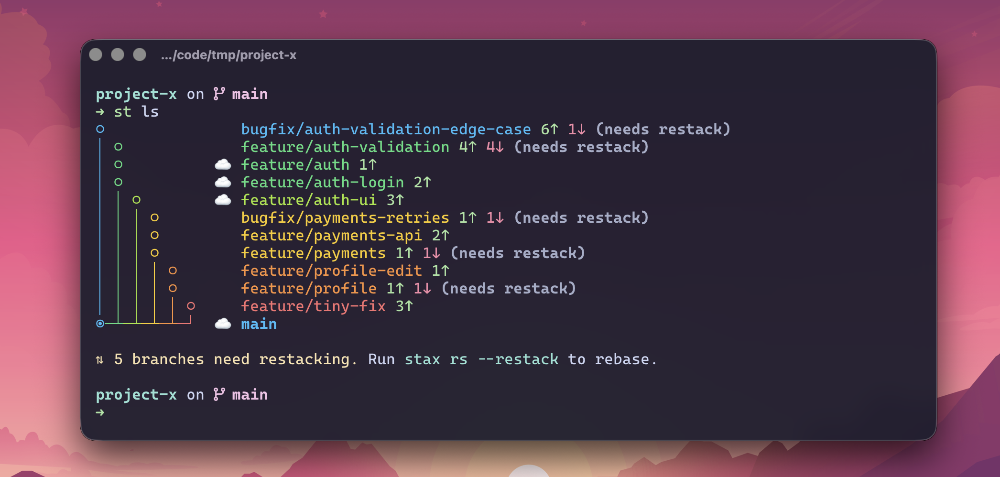
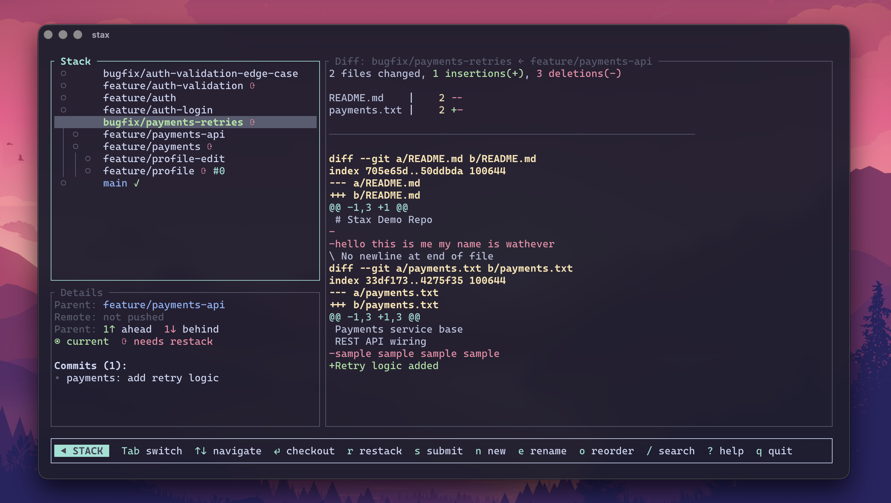

<div align="center">
  <h1>stax</h1>

  <p><strong>Stacked Git branches and PRs — fast, safe, and built for humans and AI agents.</strong></p>

  <p>
    <a href="https://github.com/cesarferreira/stax/actions/workflows/rust-tests.yml"></a>
    <a href="https://crates.io/crates/stax"></a>
    <a href="https://github.com/cesarferreira/stax/releases"></a>
    
  </p>

  <p>
    <a href="#install">Install</a>
    &nbsp;·&nbsp;
    <a href="#quickstart">Quickstart</a>
    &nbsp;·&nbsp;
    <a href="#commands">Commands</a>
    &nbsp;·&nbsp;
    <a href="https://cesarferreira.github.io/stax/">Docs</a>
  </p>

  <br>

  
</div>

---

## Why stax

One giant PR is slow to review and risky to merge. A stack of small PRs is the answer — but managing stacks by hand with `git rebase --onto` is a footgun. **stax** makes stacks a first-class Git primitive.

- **Stack, don't wait.** Keep shipping on top of in-review PRs. `st create`, `st ss`, done.
- **Native-fast.** A single Rust binary that starts in ~25ms. `st ls` benches ~16× faster than Graphite/Freephite on this repo.
- **Agent-native.** Run parallel AI agents on isolated branches (`st lane`), auto-resolve rebase conflicts (`st resolve`), and generate PR bodies from real diffs.
- **Undo-first.** Every destructive op snapshots state. `st undo` / `st redo` rescue risky rebases instantly.
- **Batteries-included TUI.** Run bare `st` to browse the stack, inspect diffs, and watch CI hydrate live.

> `stax` installs two binaries: `stax` and the short alias `st`. This README uses `st`.

## Install

The shortest path on macOS and Linux:

```bash
brew install cesarferreira/tap/stax
```

<details>
<summary><strong>Other installation methods</strong> — cargo-binstall, prebuilt binaries, Windows, from source</summary>

### cargo-binstall

```bash
cargo binstall stax
```

### Prebuilt binaries

Download the latest binary from [GitHub Releases](https://github.com/cesarferreira/stax/releases):

```bash
# macOS (Apple Silicon)
curl -fsSL https://github.com/cesarferreira/stax/releases/latest/download/stax-aarch64-apple-darwin.tar.gz | tar xz
# macOS (Intel)
curl -fsSL https://github.com/cesarferreira/stax/releases/latest/download/stax-x86_64-apple-darwin.tar.gz | tar xz
# Linux (x86_64)
curl -fsSL https://github.com/cesarferreira/stax/releases/latest/download/stax-x86_64-unknown-linux-gnu.tar.gz | tar xz
# Linux (arm64)
curl -fsSL https://github.com/cesarferreira/stax/releases/latest/download/stax-aarch64-unknown-linux-gnu.tar.gz | tar xz

mkdir -p ~/.local/bin
mv stax st ~/.local/bin/
# Ensure ~/.local/bin is on your PATH:
# echo 'export PATH="$HOME/.local/bin:$PATH"' >> ~/.zshrc
```

**Windows (x86_64):** download `stax-x86_64-pc-windows-msvc.zip` from [Releases](https://github.com/cesarferreira/stax/releases), extract `stax.exe` and `st.exe`, and place them on your `PATH`. See [Windows notes](#windows-notes).

### Build from source

Prereqs:
- Debian/Ubuntu: `sudo apt-get install libssl-dev pkg-config`
- Fedora/RHEL: `sudo dnf install openssl-devel`
- Arch: `sudo pacman -S openssl pkg-config`
- macOS: OpenSSL included

Then:

```bash
cargo install --path . --locked
# or
make install
```

No system OpenSSL? Use the vendored feature:

```bash
cargo install --path . --locked --features vendored-openssl
```

</details>

Verify the install:

```bash
st --version
```

<a id="quickstart"></a>
## Quickstart

`st setup` handles shell integration, AI agent skills, and GitHub auth in a single step:

```bash
st setup --yes
```

<details>
<summary>Alternative auth options</summary>

```bash
# Import from GitHub CLI
gh auth login && st auth --from-gh

# Enter a token interactively
st auth

# Or via env var
export STAX_GITHUB_TOKEN="ghp_xxxx"
```

By default stax ignores ambient `GITHUB_TOKEN`. Opt in with `auth.allow_github_token_env = true`.

</details>

Now ship a two-branch stack end-to-end:

```bash
# 1. Stack two branches on trunk
st create auth-api
st create auth-ui

# 2. See the stack
st ls
# ◉  auth-ui        1↑
# ○  auth-api       1↑
# ○  main

# 3. Submit the whole stack as linked PRs
st ss

# 4. After the bottom PR merges on GitHub…
st rs --restack    # pull trunk, clean merged, rebase the rest
```

Picked the wrong trunk? Run `st trunk main` or `st init --trunk <branch>` to reconfigure.

Next: [Quick Start guide](docs/getting-started/quick-start.md) · [Merge & cascade workflow](docs/workflows/merge-and-cascade.md)

## Highlights

### Parallel AI lanes

Spin up multiple AI agents on isolated branches, all tracked as normal stax branches:

```bash
st lane fix-auth-refresh "Fix the token refresh edge case from #142"
st lane stabilize-ci     "Stabilize the 3 flaky tests in the checkout flow"
st lane api-docs         "Update API docs for the /users endpoint"
```

Each lane is a real Git worktree with normal stax metadata — it appears in `st ls`, participates in restack/sync/undo, and re-attaches via tmux any time. No hidden scratch directories, no lost work.

```bash
st wt         # open the worktree dashboard
st wt rs      # restack every lane at once when trunk moves
st ss         # submit PRs for the ones that are ready
```

→ [Agent worktrees](docs/workflows/agent-worktrees.md) · [Multi-worktree workflow](docs/workflows/multi-worktree.md)

### Cascade stack merge

Merge from the bottom of the stack up to your current branch, with CI and readiness checks:

```bash
st merge              # local cascade merge
st merge --when-ready # wait/poll until PRs are mergeable
st merge --remote     # merge remotely on GitHub while you keep working
st merge --all        # merge the whole stack regardless of position
```

→ [Merge and cascade](docs/workflows/merge-and-cascade.md)

### AI conflict resolution

When a rebase stops on a conflict, `st resolve` sends only the conflicted text files to your configured AI agent, applies the result, and resumes the rebase automatically. If the AI returns invalid output, touches a non-conflicted file, or leaves extra conflicts behind, stax bails out and preserves the in-progress rebase so you can inspect or continue manually.

```bash
st resolve
st resolve --agent codex --model gpt-5.3-codex
```

### Undo / redo

`restack`, `submit`, and `reorder` each snapshot branch state before they touch anything. Recovery is one command away.

```bash
st restack
st undo
st redo
```

→ [Undo/redo safety](docs/safety/undo-redo.md)

### Interactive TUI

<p align="center">
  
</p>

Bare `st` launches a full-screen TUI for browsing stacks, inspecting branch summaries and patches, watching live CI hydrate, and running common ops without leaving the terminal.

→ [TUI guide](docs/interface/tui.md)

### AI PR bodies and standups

```bash
st generate --pr-body      # draft/refresh PR body from branch diff + context
st standup --summary       # spoken-style daily engineering summary
```

Each AI feature (`generate`, `standup`, `resolve`, `lane`) can use a different agent/model. Configure with:

```bash
st config --set-ai
```

→ [PR templates & AI](docs/integrations/pr-templates-and-ai.md) · [Reporting](docs/workflows/reporting.md)

<a id="commands"></a>
## Commands

| Command | What it does |
|---|---|
| `st` | Launch interactive TUI |
| `st ls` / `st ll` | Show stack (with PR status / with PR URLs and details) |
| `st create <name>` | Create a branch stacked on current |
| `st ss` | Submit the full stack, open/update linked PRs |
| `st merge` | Cascade-merge from bottom to current (`--when-ready`, `--remote`, `--all`) |
| `st rs` / `st rs --restack` | Sync trunk, clean merged branches, optionally rebase |
| `st restack` | Rebase current stack onto parents locally |
| `st cascade` | Restack + push + open/update PRs |
| `st split` | Split a branch into stacked branches (by commit or `--hunk`) |
| `st lane <name> "<task>"` | Spawn an AI agent on a new lane |
| `st wt` | Open the worktree dashboard |
| `st resolve` | AI-resolve an in-progress rebase conflict |
| `st generate --pr-body` | Draft/refresh PR body with AI |
| `st standup` | Summarize recent engineering activity |
| `st undo` / `st redo` | Recover / reapply risky operations |
| `st run <cmd>` | Run a command on each branch in the stack |
| `st pr` / `st pr list` / `st issue list` | Open current PR · list PRs · list issues |

Full reference: [docs/commands/core.md](docs/commands/core.md) · [docs/commands/reference.md](docs/commands/reference.md)

## Performance

Benchmarked with `hyperfine` on this repo. Absolute times vary by repo and machine; the ratios do not.

| Benchmark      | stax     | vs [Freephite](https://github.com/bradymadden97/freephite) | vs [Graphite](https://github.com/withgraphite/graphite-cli) |
|----------------|----------|-----------------|----------------|
| `st ls`        | baseline | **16.25×** faster | **10.05×** faster |
| `st rs` (sync) | baseline | **2.41×** faster  | —              |

stax is wire-compatible with Freephite/Graphite for common stacked-branch workflows.

→ [Full benchmarks](docs/reference/benchmarks.md) · [Compatibility notes](docs/compatibility/freephite-graphite.md)

## Configuration

```bash
st config                  # open the config editor
st config --set-ai         # pick AI agent + model
st config --reset-ai       # clear saved AI pairing and re-prompt
```

Config lives at `~/.config/stax/config.toml`:

```toml
[submit]
stack_links = "body"   # "comment" | "body" | "both" | "off"
```

→ [Full config reference](docs/configuration/index.md)

## Integrations

AI and editor integration guides:

- [Claude Code](docs/integrations/claude-code.md)
- [Codex](docs/integrations/codex.md)
- [Gemini CLI](docs/integrations/gemini-cli.md)
- [OpenCode](docs/integrations/opencode.md)
- [PR templates + AI generation](docs/integrations/pr-templates-and-ai.md)

Shared skill/instruction file used across agents: [skills.md](skills.md)

<a id="windows-notes"></a>
<details>
<summary><strong>Windows notes</strong> — shell integration, worktrees, tmux</summary>

stax runs on Windows (x86_64) with prebuilt binaries on [Releases](https://github.com/cesarferreira/stax/releases). Most commands work identically, with these limitations:

- **Shell integration is not available.** `st setup` supports bash/zsh/fish only. On Windows:
  - `st wt c` / `st wt go` create and navigate worktrees but cannot auto-`cd` the parent shell. Manually `cd` to the printed path.
  - The `sw` quick alias is not available.
  - `st wt rm` (bare) cannot relocate the shell. Specify: `st wt rm <name>`.
- **Worktree commands still work.** `st wt c/go/ls/ll/cleanup/rm/prune/restack` all function — only the shell-level `cd` is missing.
- **tmux integration requires WSL** or a Unix-like environment.

Everything else — stacked branches, PRs, restack, sync, undo/redo, TUI, AI generation — works on Windows without limitation.

</details>

## Contributing

Before opening a PR, run:

```bash
make test   # or: just test
```

To cut a release, run:

```bash
make release          # default minor bump
make release LEVEL=patch
just release-patch    # or: just release-minor / just release-major
```

Release automation now rebuilds the `Unreleased` section in `CHANGELOG.md` from commits since the latest `v*` tag before handing off to `cargo release`. If there are no commits since the last tag, the release exits early instead of creating an empty changelog entry.

Project docs and architecture: [docs/index.md](docs/index.md). Contributor guidelines: [AGENTS.md](AGENTS.md).

## License

MIT &copy; Cesar Ferreira
