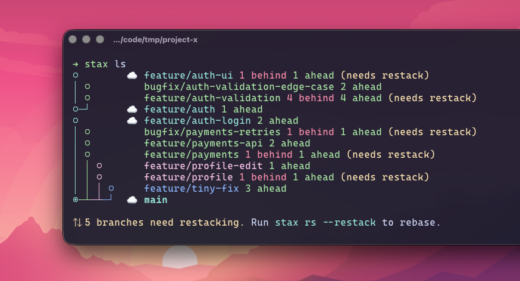

# stax

A modern CLI for stacked Git branches and PRs.

## Why stax?

- Blazing fast Rust binary (~22ms `stax ls` on a 10-branch stack)
- Interactive TUI with tree view, PR status, diffs, reorder mode, and split mode
- Submit/update complete stacks with correct PR bases in one command
- Transactional history operations with `stax undo` and `stax redo`
- Freephite-compatible metadata, so existing stacks can be used immediately

## Start Here

1. [Install](getting-started/install.md)
2. [Quick Start](getting-started/quick-start.md)
3. [Core Commands](commands/core.md)

## Common Tasks

- Learn stacked-branch flow: [Stacked Branches](concepts/stacked-branches.md)
- Work interactively in terminal: [Interactive TUI](interface/tui.md)
- Merge an entire stack safely: [Merge and Cascade](workflows/merge-and-cascade.md)
- Recover from risky rewrites: [Undo and Redo](safety/undo-redo.md)
- Configure auth and naming: [Config Reference](configuration/index.md)
