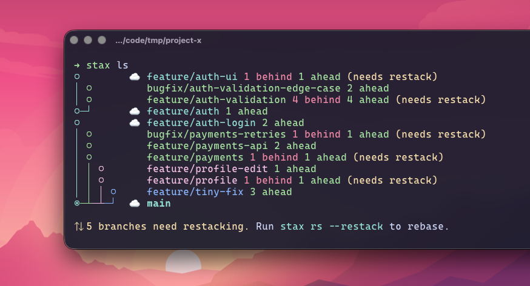

# stax

**Stacked Git branches and PRs — fast, safe, and built for humans and AI agents.**

## Why stax

- **Stack, don't wait.** Keep shipping on top of in-review PRs.
- **Native-fast.** A single Rust binary; `st ls` benches ~70× faster than Graphite and ~215× faster than Freephite on this repo.
- **Agent-native.** Parallel AI lanes (`st lane`), AI conflict resolution (`st resolve`), AI-drafted PR bodies.
- **Undo-first.** Every destructive op is snapshotted. `st undo` / `st redo` rescue risky rebases.
- **Drop-in compatible.** Same metadata format as Freephite — existing stacks work immediately.

## Start here

1. [Install](getting-started/install.md)
2. [Quick start](getting-started/quick-start.md)
3. [Core commands](commands/core.md)

## Learn by goal

| I want to… | Go to |
|---|---|
| Understand stacked-branch workflow | [Stacked branches](concepts/stacked-branches.md) |
| Keep multiple independent stacks | [Multiple stacks](concepts/multiple-stacks.md) |
| Drive stax from the terminal UI | [Interactive TUI](interface/tui.md) |
| Watch the stack live with CI and PR status | `st watch` |
| Merge an entire stack safely | [Merge and cascade](workflows/merge-and-cascade.md) |
| Run parallel AI coding sessions | [AI worktree lanes](workflows/agent-worktrees.md) |
| Manage Git worktrees as lanes | [Worktrees](worktrees/index.md) |
| Understand worktree-aware behavior | [Multi-worktree behavior](workflows/multi-worktree.md) |
| Recover from a bad rewrite | [Undo and redo](safety/undo-redo.md) |
| Validate or repair stack metadata | [Stack health](commands/stack-health.md) |
| Generate branch names, PR bodies, or standup summaries | [Reporting](workflows/reporting.md) · [PR templates + AI](integrations/pr-templates-and-ai.md) |
| Configure auth, naming, or AI agents | [Configuration](configuration/index.md) |
| Cut a release with auto-generated changelog | [Release workflow](workflows/releasing.md) |
| Use stax alongside a specific AI tool | [Integrations](integrations/claude-code.md) |
| Migrate from Freephite or Graphite | [Compatibility](compatibility/freephite-graphite.md) |
| See the full command surface | [Full reference](commands/reference.md) |
