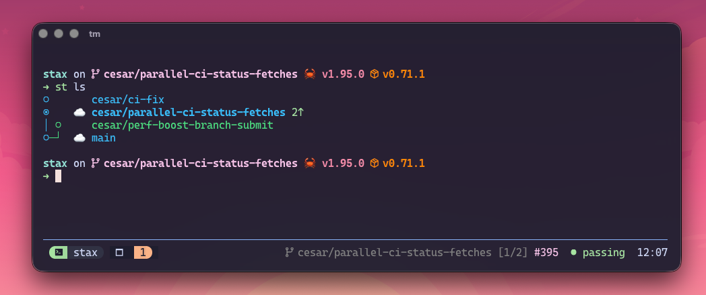

# stax.tmux

[**stax.tmux**](https://github.com/cesarferreira/stax.tmux) is a TPM-compatible plugin that puts your stack in the tmux status bar and adds keybindings for common actions.



## Features

- **Live status bar** — branch, stack position, PR number, and CI state; auto-refreshes in the background
- **Keybindings** — `prefix + S` popup, `prefix + ]`/`[` navigate up/down the stack, `prefix + M-s` sync
- **Window auto-rename** — tmux window title follows the current branch automatically

## Install

### With TPM (recommended)

Add to `~/.tmux.conf`:

```tmux
set -g @plugin 'cesarferreira/stax.tmux'
```

Then press `prefix + I` to install.

### Manual

```bash
git clone https://github.com/cesarferreira/stax.tmux ~/.tmux/plugins/stax.tmux
~/.tmux/plugins/stax.tmux/stax.tmux
```

## Status bar format

```
cesar/fix/refresh-pr-draft-on-sync [1/1] #394  running  15:12
```

| Segment | Meaning |
|---------|---------|
| Branch | Current git branch |
| `[1/1]` | Position in stack |
| `#394` | PR number |
| `running` | CI state |

## Related

- [stax.tmux repository](https://github.com/cesarferreira/stax.tmux)
- [Claude Code](claude-code.md) · [Codex](codex.md) · [Gemini CLI](gemini-cli.md) · [OpenCode](opencode.md)
