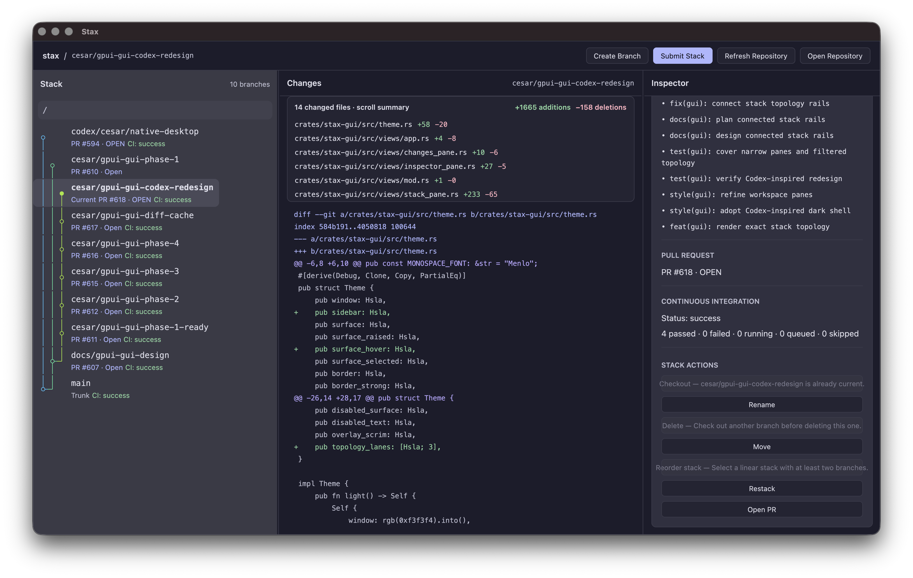

# GUI

The native Stax GUI for macOS shares the same typed repository operations and receipts as the CLI/TUI adapters. GitHub Releases publishes separate Apple Silicon and Intel app archives alongside the CLI artifacts.

## Install

For Apple Silicon:

```bash
curl -fLO https://github.com/cesarferreira/stax/releases/latest/download/Stax-aarch64-apple-darwin.zip
ditto -x -k Stax-aarch64-apple-darwin.zip .
mv Stax.app /Applications/
```

Use `Stax-x86_64-apple-darwin.zip` on Intel. The app is a separate artifact on the same release, not a new package, and it does not enlarge the CLI binaries.

Unsigned builds are usable without weakening system security: download only from the project GitHub Releases page, Control-click `Stax.app`, choose **Open**, then choose **Open** again. If Gatekeeper blocks the first launch, use **System Settings → Privacy & Security → Open Anyway**. Never disable Gatekeeper globally. When maintainers configure signing and notarization, the same artifact names open through the normal macOS flow.

Contributors can build and register a local bundle instead:

```bash
make gui-app
make install-gui-app
```

The install target writes `$HOME/Applications/Stax.app`. Public and local bundles use `com.cesarferreira.stax`.

## Launch and windows

Launch the GUI from a repository:

```bash
st gui
```

Or launch it for an explicit repository path:

```bash
st gui /path/to/repo
```

When `[path]` is omitted, Stax uses the current directory. The launcher canonicalizes the chosen path, then invokes LaunchServices with:

```bash
open -n -b com.cesarferreira.stax --args <canonical-path>
```

The `-n` flag is part of the contract. Every `st gui [path]` invocation opens a fresh app process/window and forwards exactly one canonical repository path after `--args`. If LaunchServices cannot find or start the bundle, install `Stax.app` in `/Applications` or run `make install-gui-app` and confirm `$HOME/Applications/Stax.app` exists.

## Workspace



The workspace shows the repository stack, the selected branch changes, and an inspector for branch actions and status. Background hydration refreshes CI, PR, and diff data without blocking normal browsing. Selecting a branch changes the visible details; it does not check out the branch until you explicitly run Checkout.

Press `/` to focus case-insensitive branch-name search. Up and Down move through the filtered rows, Enter checks out the selected result, and Escape clears the query and restores the selection from before search. A query with no matches leaves the workspace geometry intact.

Stack, Changes, and Inspector visibility and widths are remembered independently for each canonical repository path. Use `1`, `2`, and `3` to toggle panes, or drag a divider to resize adjacent panes. Stax refuses to hide the final visible pane, and Tab traversal skips panes that are not rendered.

## Confirmed mutations

The GUI exposes the following confirmed, repository-scoped operations:

- **Checkout** checks out the selected tracked branch in the opened repository.
- **Create** creates an explicit-name empty child branch under the selected parent.
- **Rename** changes an eligible selected local branch name after validating the replacement name. It does not push or delete a remote branch.
- **Delete** shows the selected branch and affected descendants before deleting eligible local branches.
- **Move** chooses a new parent, previews the immutable source and target, and asks for confirmation before moving the selected subtree. A dirty-worktree rejection offers a second explicit auto-stash confirmation.
- **Reorder** edits and previews the proposed linear stack order before a final confirmation. Forked stacks are rejected. A dirty-worktree rejection offers a second explicit auto-stash confirmation.
- **Restack** restacks the selected branch scope, while **Restack All** restacks all tracked non-trunk branches.
- **Stash-and-restack** appears only after an explicit dirty-worktree confirmation; Stax tells you which worktrees need stashing and keeps stashes if a conflict stops the rebase.
- **Submit Stack** first shows an explicit confirmation with the affected branches, `New pull requests: Draft`, and the remote warning. Confirming pushes branches and creates or updates PRs as Draft.
- **Undo/Redo** are offered only for receipts whose transaction is entirely local. They target the recorded operation id. Receipts with remote effects keep their CLI recovery guidance instead of presenting an unsafe GUI undo.

Submit does not show CLI prompts and does not auto-open PR pages. To inspect a PR, use Open PR on the selected branch.

## Shortcuts

Workspace shortcuts:

| Shortcut | Action |
|---|---|
| Enter | Check out selected branch |
| `n` | Create explicit-name child branch |
| `e` | Rename selected branch |
| `d` | Delete selected branch |
| `m` | Move selected subtree to another parent |
| `o` | Reorder the selected linear stack |
| `r` | Restack selected branch scope |
| Shift-R | Restack all tracked branches |
| `s` | Confirm submit current stack as Draft |
| `p` | Open PR for selected branch without checkout |
| `/` | Focus stack search |
| `1` / `2` / `3` | Toggle Stack / Changes / Inspector |
| Tab | Move focus, skipping hidden panes |
| Cmd-Z / Cmd-Shift-Z | Confirm safe local undo / redo |
| Cmd-R | Refresh repository snapshot |
| Cmd-O | Open another repository |
| Up / Down | Move selection |

Overlay shortcuts are Enter to confirm and Escape to dismiss. Text input and picker contexts have priority over workspace shortcuts, so editing a branch name or search query does not trigger operation or pane actions.

The native Stax, File, Edit, View, Branch, and Stack menus dispatch these same actions. Their enabled state comes from the same interaction model as the visible controls, so unsafe menu commands are disabled while a mutation is running.

All visible actions have textual labels, participate in Tab traversal when enabled, and show a contrast-tested focus border. Enter and Space activate the focused control. Disabled actions are skipped and keep their reason in the visible label. GPUI 0.2.2 does not yet expose the stable macOS accessibility-node integration needed to claim complete VoiceOver support.

## Progress and receipts

Operations report structured progress with stage, branch, completed count, and total when available. Warnings are data, not terminal text, and remain visible in the operation banner.

Successful submit receipts show Created, Updated, or Unchanged PR rows with clickable HTTP(S) URLs. Structural receipts preserve the exact ref transitions used by safe local undo/redo. The banner can copy diagnostics for failures and can be dismissed after terminal success or failure. Dismissing the banner changes only GUI presentation; it does not remove persisted operation receipts or refresh data.

## Safety and recovery

Only one mutating operation runs at a time. While a mutation is active, checkout, create, rename, delete, move, reorder, undo/redo, restack, submit, Open Repository, Refresh, Open PR, and navigation actions are disabled in controls, shortcuts, and menus because an in-flight Git mutation cannot be cancelled safely. The GUI intentionally exposes no cancel control during an active mutation.

On success, and on failures that may have changed local or remote state, the GUI refreshes the repository snapshot and preserves the receipt or error. On guaranteed no-side-effect failures, it leaves the current snapshot in place. If a rebase stops for conflicts, resolve them in the repository with the normal CLI flow: inspect the worktree, fix conflicts, then run `st continue`, `st abort`, or `st resolve` as appropriate before retrying in the GUI.

## Current limits

The GUI intentionally leaves advanced workflows in the CLI:

- AI-generated branch names and PR details.
- Staging, commit creation, `--below`, `--insert`, custom branch prefixes, and other advanced create modes.
- Advanced submit options such as reviewers, labels, templates, AI prompting, ready-for-review mode, and auto-open behavior.

The first public release has no automatic updater, Homebrew cask, universal binary, Windows GUI, or Linux GUI. Install updates from GitHub Releases; the existing Homebrew formula remains CLI-only.
