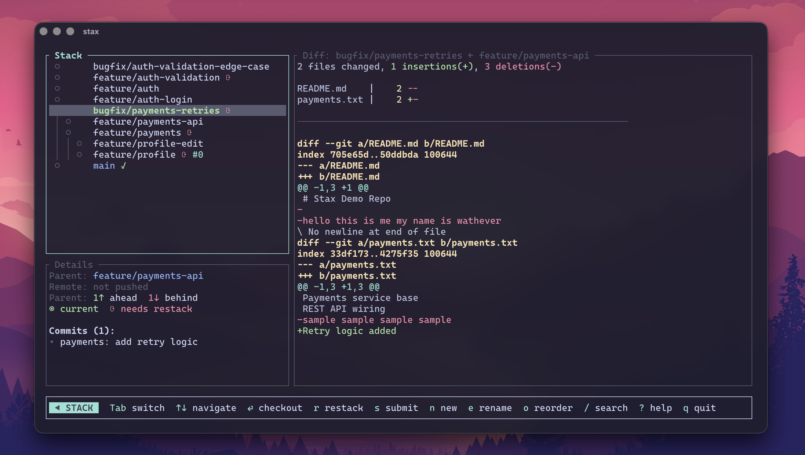
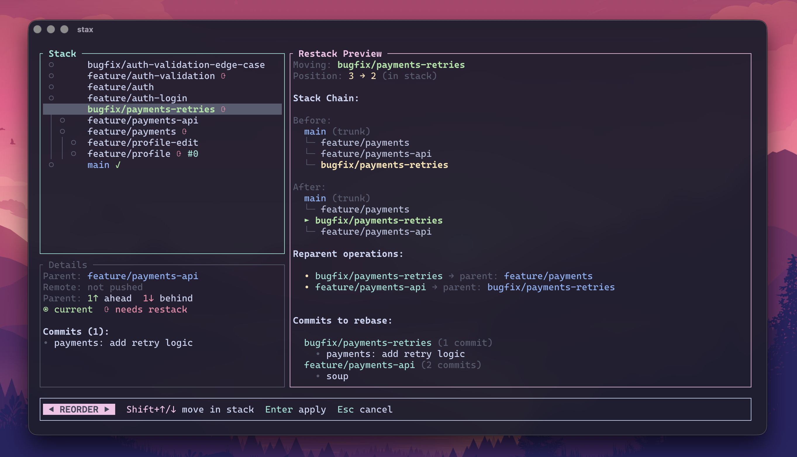

# Interactive TUI

Run `stax` with no arguments to open the terminal UI.

```bash
stax
```



## Features

- Stack tree with PR status, sync indicators, and ahead/behind counts
- Branch diff viewer
- Keyboard-driven checkout, restack, submit, create, rename, and delete
- Reorder mode for branch reparenting

## Keybindings

| Key | Action |
|---|---|
| `↑/↓` | Navigate branches |
| `Enter` | Checkout branch |
| `r` | Restack selected branch |
| `s` | Submit stack |
| `o` | Enter reorder mode |
| `n` | Create branch |
| `d` | Delete branch |
| `?` | Show keybindings |

## Reorder Mode



1. Select a branch and press `o`
2. Move with `Shift+↑/↓`
3. Review previewed reparent operations
4. Press `Enter` to apply and restack

## Split Mode

Split a branch with many commits into multiple stacked branches.

```bash
stax split
```

| Key | Action |
|---|---|
| `j/k` or `↑/↓` | Navigate commits |
| `s` | Add split point at cursor |
| `d` | Remove split point |
| `Enter` | Execute split |
| `q`/`Esc` | Cancel |

Split operations are transactional and recoverable with `stax undo`.
