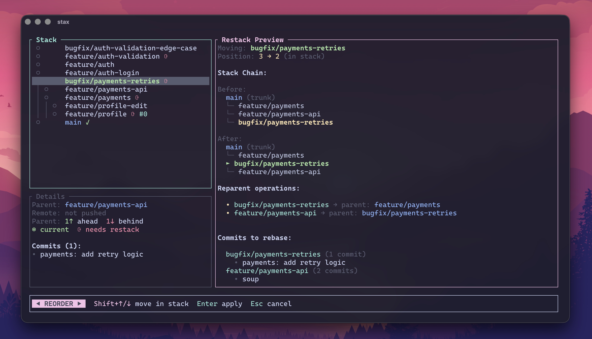

# Interactive TUI

Run `st` with no arguments to open the stack dashboard.

```bash
stax
```


## Features

- Full-height stack tree with PR status, sync indicators, and ahead/behind counts
- Selected-branch summary with recommended next actions and live CI progress
- Patch viewer with a compact diffstat header and scrollable body
- Keyboard-driven checkout, restack, submit, create, rename, delete
- Reorder mode for reparenting branches

The dashboard renders immediately from local stack data, then fetches live CI for the selected branch in the background. While checks are running, the stack row shows a completed/total counter and the summary pane expands with pass/fail/running counts plus elapsed/ETA.

The main `st` TUI is focused on stacks and patches. Worktree management lives in the dedicated [`st wt` dashboard](../worktrees/index.md#dashboard).

## Keybindings

| Key | Action |
|---|---|
| `j/k` or `↑/↓` | Navigate branches |
| `Enter` | Checkout branch |
| `r` | Restack selected branch |
| `R` (Shift+r) | Restack all branches in stack |
| `s` | Submit stack |
| `p` | Open selected branch PR |
| `o` | Enter reorder mode |
| `n` | Create branch |
| `e` | Rename current branch |
| `d` | Delete branch |
| `/` | Search / filter branches |
| `Tab` | Toggle focus between stack and patch panes |
| `?` | Show keybindings |
| `q`/`Esc` | Quit |

## Reorder mode



1. Select a branch and press `o`
2. Move with `Shift+↑/↓`
3. Review previewed reparent operations
4. Press `Enter` to apply and restack

## Split mode

Split a branch with multiple commits into stacked branches.

```bash
st split
```

| Key | Action |
|---|---|
| `j/k` or `↑/↓` | Navigate commits |
| `s` | Add split point at cursor |
| `d` | Remove split point |
| `S-J/K` | Move split point down/up |
| `Enter` | Execute split |
| `?` | Toggle help |
| `q`/`Esc` | Cancel |

Splits are transactional and recoverable with `st undo`.

## Hunk split mode

Split a single-commit branch by selecting individual diff hunks.

```bash
st split --hunk
```

Two-pane layout: file/hunk list on the left, diff preview on the right. Splitting happens in rounds — select hunks, name the new branch, repeat until all hunks are assigned.

### List mode (default)

| Key | Action |
|---|---|
| `j/k` or `↑/↓` | Navigate files and hunks |
| `Space` | Toggle hunk selection |
| `a` | Toggle all hunks in current file |
| `u` | Undo last selection change |
| `Tab` | Switch to sequential mode |
| `Enter` | Finish round (proceed to naming) |
| `?` | Show help |
| `q`/`Esc` | Abort |

### Sequential mode

Step through hunks one at a time with yes/no prompts. Press `Tab` to return to list mode.

| Key | Action |
|---|---|
| `y` | Accept hunk and advance |
| `n` | Skip hunk and advance |
| `a` | Toggle file and jump to next file |
| `u` | Undo |
| `Enter` | Finish round |

### Flow

1. Select hunks for the first new branch
2. Press `Enter`, confirm the branch name
3. Repeat for remaining hunks
4. stax creates the branch chain and updates stack metadata after the last round

Default branch name suggestion: `<original>_split_N` for intermediate rounds, original name for the final round. Recoverable with `st undo`.
