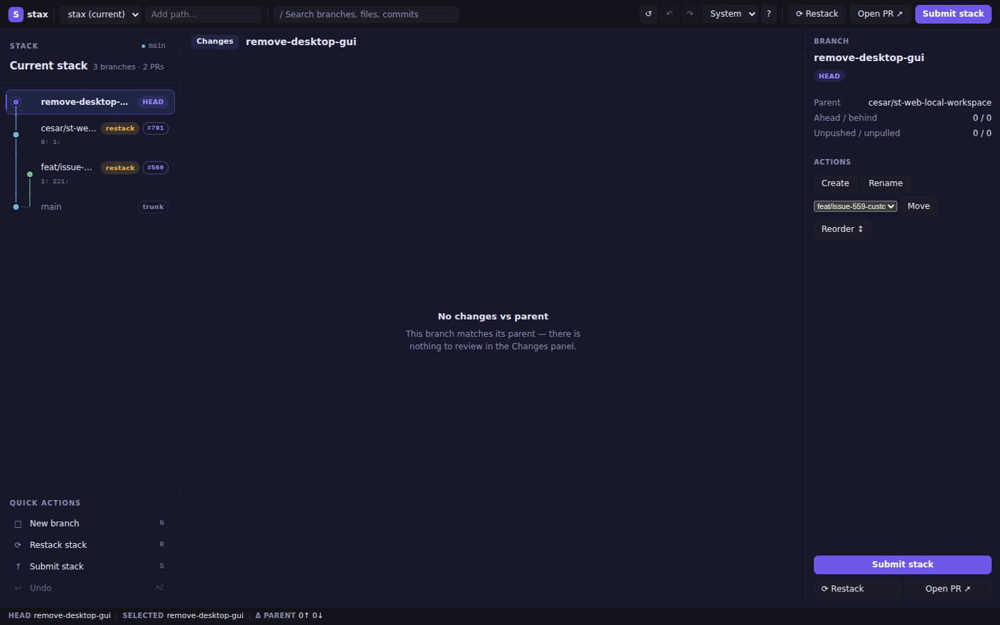

# st web — Localhost Web Workspace



`st web` starts a fast, secure, browser-based workspace for stax on `127.0.0.1`. The layout uses a three-column reference design: a connected stack rail on the left, a review workspace in the centre, and a branch inspector on the right — all powered by [HTMX](https://htmx.org/) for partial-page updates without a JavaScript framework.

## Quick start

```bash
st web            # opens port 8787, or warns and uses a free port if busy
st web --port 0   # ephemeral port (chosen by OS)
st web --no-open  # start without opening browser; prints URL
st web /path/inside/repo  # discover and open a specific worktree
```

The current directory or explicit `[PATH]` may be anywhere inside a Git worktree. Stax discovers the enclosing worktree root before starting the server.

## Flags

| Flag | Default | Description |
|------|---------|-------------|
| `[PATH]` | current directory | Repository or path inside one to open |
| `--port <N>` | `8787` | Port to bind. `0` picks an ephemeral port. If the port is busy, stax warns and uses a free OS-selected port. |
| `--no-open` | false | Skip opening the browser; just print the URL. |

## Layout

```
┌─ Top bar: [S stax] repo ▾ │ / search ⌘K │ ↺ ↶ ↷ theme ? │ Restack  Open PR ↗  Submit stack ─┐
├─────────────────┬──────────────────────────────┬────────────────────────────────────────────┤
│ STACK      main │ feat/branch   2 commits …    │ BRANCH                                     │
│ Current stack   │ [Changes]                    │ feat/branch [HEAD] [clean]                 │
│ 3 branches·2PRs │ ─ Changed files ─────────── │                                            │
│ ● feat/branch   │  foo.rs  +12  │ 1  context  │ Parent   main                              │
│ ○ web-foundation│  bar.rs   +3  │ 2  context  │ A/B      2 / 0                             │
│ ● main          │               │ 3 -old line │ Remote   tracked                           │
│                 │               │ 3 +new line │                                            │
│ QUICK ACTIONS   │               │             │ FULL REQUEST                               │
│ □ New branch  N │               │             │ #742  ● passing                            │
│ ⟳ Restack    R  │               │             │ Draft  No                                  │
│ ↑ Submit     S  │               │             │                                            │
│ ↩ Undo      ⌘Z  │               │             │ COMMITS                                    │
│                 │               │             │ a1b2c3d  feat: add feature                 │
│                 │               │             │ ─────────────────────────────              │
│                 │               │             │      [     Submit stack     ]              │
│                 │               │             │      [ ⟳ Restack ] [Open PR ↗]            │
├─────────────────┴──────────────────────────────┴────────────────────────────────────────────┤
│ Status: HEAD main · Selected feat/branch · Δ parent 3↑ 0↓ · PR #42                        │
└─────────────────────────────────────────────────────────────────────────────────────────────┘
```

Press `1`, `2`, `3` to toggle each pane.

### Panels

| Panel | Role |
|-------|------|
| **Stack rail** | Connected branch cards with topology connectors, stack summary, and compact quick actions. Selecting a card does **not** check out — use the `co` button. |
| **Review workspace** | Selected branch header (branch name, file count, +/- totals) followed by a narrow changed-file navigator beside a large diff pane with old/new line numbers. Only the **Changes** view is rendered; Commits and Stack preview are intentionally omitted. |
| **Branch inspector** | Branch identity, divergence, remote state, pull-request details, and commit list with a dominant **Submit stack** CTA at the bottom. |
| **Status bar** | Current HEAD, selected branch, ahead/behind vs parent, restack/PR badges. Refreshes with the stack. |

## Appearance

The top-bar **System / Light / Dark** control sets the workspace theme:

| Mode | Behaviour |
|------|-----------|
| **System** (default) | Follows the OS `prefers-color-scheme` setting |
| **Light** | Forces the light palette |
| **Dark** | Forces the dark palette (off-black surfaces, restrained violet accent) |

The preference is stored per repository in `.git/stax/web-state.json`.

## Keyboard shortcuts

| Key | Action |
|-----|--------|
| `/` | Focus the search box |
| `1` | Toggle stack pane |
| `2` | Toggle changes pane |
| `3` | Toggle inspector pane |
| `N` | New branch (quick action; guarded outside inputs/overlays) |
| `R` | Restack stack (quick action) |
| `S` | Submit stack (quick action) |
| `Esc` | Dismiss overlay / blur search |
| `?` | Show keyboard-shortcut help |

## Available operations (via top bar, branch cards, inspector, or quick actions)

- **Checkout** — click a branch card's `co` button
- **Restack** — restack the selected branch onto its parent
- **Submit** — push the stack and create/update PRs (draft mode)
- **Undo / Redo** — restore local transaction state (top-bar utility buttons)
- **Refresh** — reload the repository snapshot (top-bar `↺` button)
- **Rename** — rename a branch (inspector Actions → Rename overlay)
- **Create** — create a new branch stacked on the selected one (inspector or quick action `N`)
- **Delete** — delete a non-current branch (inspector Actions)
- **Move** — reparent a branch subtree (inspector Actions → Move form)

## Security model

- Binds **127.0.0.1 only** — not accessible on the network.
- Every URL contains an **unguessable 48-hex session token**: `/s/<token>/…`.
- Every mutating POST requires a matching **CSRF token** (`csrf` form field). Requests with wrong CSRF return `403 Forbidden`.
- `Host` must be `127.0.0.1` or `localhost`. An absent `Origin` is allowed for navigation and non-browser clients; when present, exactly one `Origin` header must equal `http://127.0.0.1:<actual-bound-port>`. Cross-site, malformed, duplicate, and wrong-port Origins return `403 Forbidden`.
- Only **one mutation at a time** — mutating controls are disabled while an operation is in flight.
- `--host` flag is intentionally absent — you cannot expose this server to the network.

## Routes reference

| Method | Path | Description |
|--------|------|-------------|
| `GET` | `/assets/app.css` | Embedded CSS (light, dark, and system themes) |
| `GET` | `/assets/htmx.min.js` | Embedded htmx 2.x |
| `GET` | `/assets/app.js` | Keyboard shortcuts, pane rehydration, file-nav interaction |
| `GET` | `/s/:token/` | Full workspace page |
| `GET` | `/s/:token/stack?branch=` | Stack pane partial (+ status bar + topbar-actions OOB swaps) |
| `POST` | `/s/:token/select` | Update selected branch |
| `GET` | `/s/:token/details` | Inspector hydration |
| `GET` | `/s/:token/diff` | Diff view (file navigator + diff pane with gutters, or empty state) |
| `GET` | `/s/:token/ci` | CI summary |
| `POST` | `/s/:token/search` | Filter branches |
| `POST` | `/s/:token/panes` | Toggle pane visibility |
| `POST` | `/s/:token/theme` | Set appearance (`system` / `light` / `dark`) |
| `POST` | `/s/:token/refresh` | Reload snapshot |
| `POST` | `/s/:token/op/checkout` | Check out a branch |
| `POST` | `/s/:token/op/create` | Create a branch |
| `POST` | `/s/:token/op/rename` | Rename a branch |
| `POST` | `/s/:token/op/delete` | Delete a branch |
| `POST` | `/s/:token/op/restack` | Restack |
| `POST` | `/s/:token/op/submit` | Submit (draft PRs) |
| `POST` | `/s/:token/op/undo` | Undo last transaction |
| `POST` | `/s/:token/op/redo` | Redo last transaction |
| `POST` | `/s/:token/op/move` | Move branch subtree |
| `GET` | `/s/:token/op/open-pr?branch=` | Redirect to PR URL |

## Architecture

```
src/web/
  mod.rs          — entry point, run_server(), start_test_server()
  server.rs       — Axum server bind logic
  session.rs      — WebSession shared state (Arc<Mutex<…>>)
  routes.rs       — all Axum handlers; CSRF + host guards
  templates.rs    — maud HTML templates (workspace, diff, inspector)
  static_assets.rs — embedded CSS/JS via include_str!
  assets/
    htmx.min.js   — htmx 2.x (embedded at compile time)
```

All mutations run in `tokio::task::spawn_blocking` to avoid blocking the async runtime.
