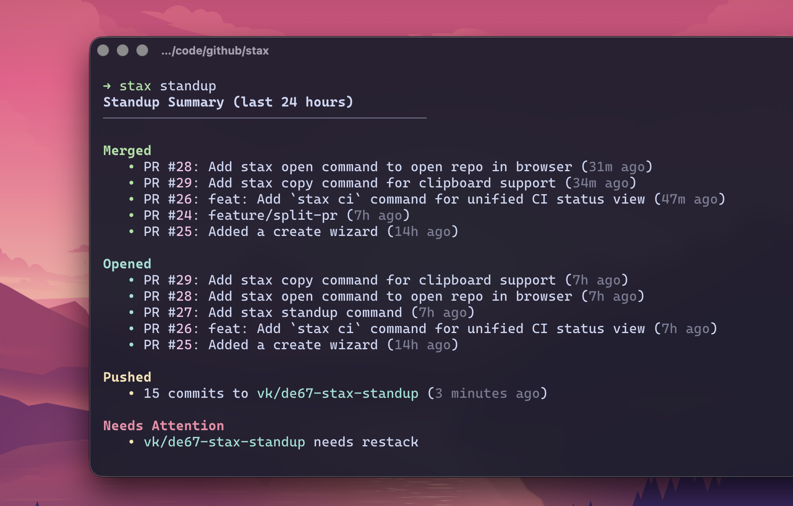

# Standup and Changelog

## Standup summary

```bash
stax standup                   # Last 24 hours (default)
stax standup --hours 48        # Look back further
stax standup --all             # Include all stacks, not just current
stax standup --json            # Raw activity data as JSON
```



Shows merged PRs, opened PRs, recent pushes, and items that need attention.

## AI standup summary

Generate a concise spoken-style summary of your activity using an AI agent:

```bash
stax standup --summary
stax standup --summary --hours 48
stax standup --summary --agent claude
stax standup --summary --agent gemini
```

Uses the AI agent configured under `[ai]` in `~/.config/stax/config.toml` (same agent as `stax generate --pr-body`). Override for a single run with `--agent`.

### Output formats

```bash
stax standup --summary                    # Spinner + colored prose (default)
stax standup --summary --plain-text       # Raw text, no colors — pipe-friendly
stax standup --summary --json            # {"summary": "..."} JSON
```

### Prerequisites

- An AI agent installed and on `PATH`: `claude`, `codex`, `gemini`, or `opencode`
- Agent configured in `~/.config/stax/config.toml`:

```toml
[ai]
agent = "claude"   # or "codex", "gemini", "opencode"
```

Or pass `--agent` directly to skip config.

## Changelog generation

```bash
stax changelog v1.0.0
stax changelog v1.0.0 v2.0.0
stax changelog abc123 def456
```

### Monorepo filtering

```bash
stax changelog v1.0.0 --path apps/frontend
stax changelog v1.0.0 --path packages/shared-utils
```

### JSON output

```bash
stax changelog v1.0.0 --json
```

PR numbers are extracted from squash-merge commit messages like `(#123)`.
