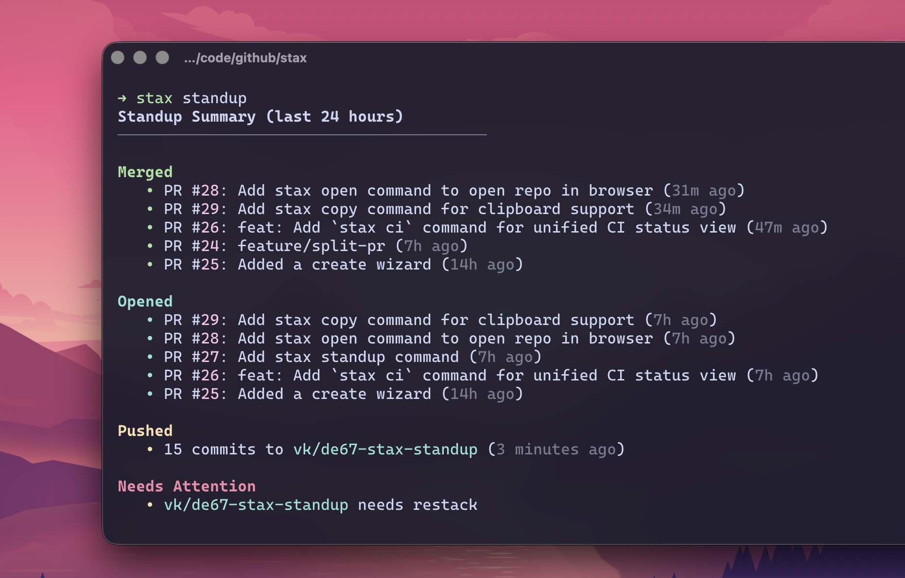

# Standup and changelog

## Standup summary

```bash
st standup                 # last 24 hours (default)
st standup --hours 48      # look back further
st standup --all           # include all stacks
st standup --json          # raw activity as JSON
st standup --ci            # also check CI for selected branches
st standup --ci --json     # CI results plus machine-readable signal states
```

Human-readable standup output shows progress while stax collects Git/forge/Jira context. Use `--json` for machine-readable output without progress lines.



Shows merged PRs, opened PRs, recent pushes, authored reviews, and items needing attention. Works with GitHub, GitLab, and Gitea.

GitHub authored reviews use one time-bounded GraphQL request capped at 100 results, followed by local repository and time filtering. GitLab and Gitea report this signal as `unsupported`; stax does not scan every merge or pull request. API and authentication failures are reported as `unavailable` instead of being presented as a successful empty result.

CI is deliberately off by default, so ordinary standup collection adds no per-branch CI latency. Pass `--ci` to check only the selected current-stack branches with bounded concurrency. `--all --ci` intentionally widens that scope to all tracked branches.

JSON keeps the compatibility arrays `reviews_given` and `needs_attention.ci_failing`. Read the companion `signals.reviews_given` and `signals.ci_failing` entries before interpreting an empty array: statuses are `available`, `unsupported`, `unavailable`, or `not_requested`, with a `reason` when useful.

## AI standup summary

Generate a concise spoken-style summary using your configured AI agent:

```bash
st standup --ai
st standup --ai --hours 48
st standup --ai --agent claude
st standup --ai --style slack  # Slack-ready Yesterday/Today bullets
st standup --ai --jit       # add Jira context via jit
```

Uses the agent configured under `[ai]` in `~/.config/stax/config.toml` (same agent as `st gen` / `st generate --pr-body`). Override per-run with `--agent`.

With `--jit`, standup inspects your current Jira sprint via the [`jit`](https://github.com/cesarferreira/jit) CLI and feeds the AI two extra signals:

- tickets with PRs already in flight
- likely next backlog tickets without PRs

The summary is word-wrapped into a card fit to your terminal width:

```text
  ✓ Generating standup summary with codex        4.1s

  ╭──────────────────────────────────────────────────────────────────╮
  │                                                                  │
  │  Yesterday I finished the billing webhook retry fix and split    │
  │  the reporting dashboard cleanup into two PRs so review stays    │
  │  small. I also opened a third PR to speed up integration tests   │
  │  by caching seed data, and all three are now in review. Today    │
  │  I'm handling review feedback and preparing the next analytics   │
  │  task.                                                           │
  │                                                                  │
  ╰──────────────────────────────────────────────────────────────────╯
```

Key phrases are highlighted: completed work in green, new work in cyan, reviews in blue, upcoming tasks in yellow.

For a copy-ready Slack update, use the Slack style:

```bash
st standup --ai --style slack
```

It prints plain text with the same shape as a team standup thread, carrying unfinished branch, PR, or Jira work into `Today` when the activity shows something is still in flight:

```text
Yesterday:
• finished the billing webhook retry fix
• opened the reporting dashboard cleanup for review

Today:
• handle review feedback
• prepare the next analytics task
```

### Output formats

```bash
st standup --ai               # spinner + colored card (default)
st standup --ai --style slack # Slack-ready Yesterday/Today bullets
st standup --ai --plain-text  # raw text, pipe-friendly
st standup --ai --json        # {"summary": "..."}
```

Progress feedback is shown for the default card and Slack styles while context collection and AI generation run. Use `--ai --plain-text` or `--ai --json` when stdout must contain only the generated summary.

### Prerequisites

- An AI agent installed on `PATH`: `claude`, `codex`, `gemini`, `opencode`, or `pi`
- For `--jit`: [`jit`](https://github.com/cesarferreira/jit) on `PATH`
- Agent configured in `~/.config/stax/config.toml`:

```toml
[ai]
agent = "claude"   # or "codex", "gemini", "opencode", "pi"
```

Or pass `--agent` directly.

## Changelog generation

```bash
st changelog                   # auto-detect last tag → HEAD
st changelog v1.0.0            # explicit from ref → HEAD
st changelog v1.0.0 v2.0.0     # between two refs
st changelog abc123 def456     # between two commits
st changelog find              # fuzzy-find commits interactively
st changelog find "auth fix"   # fuzzy-find commits in the default range
st changelog --find "auth fix" # flag form for scripts
```

PR numbers are extracted from squash-merge commit messages like `(#123)`.

`find` / `--find` searches commit messages in the same range used by `st changelog`.
Use positional refs with the flag form, for example `st changelog v1.0.0 HEAD --find "auth fix"`.
Add `--json` with a query for scriptable output.

### Monorepo tag prefix

With platform-scoped tags like `release/ios/v1.2.0`, pick the latest tag matching a prefix:

```bash
st changelog --tag-prefix release/ios
st changelog --tag-prefix release/android --json
```

### Path filtering

```bash
st changelog v1.0.0 --path apps/frontend
st changelog v1.0.0 --path packages/shared-utils
st changelog find "auth fix" --path apps/frontend
```

### JSON output

```bash
st changelog v1.0.0 --json
st changelog --json              # auto-resolved tag appears in "resolved_from"
```
